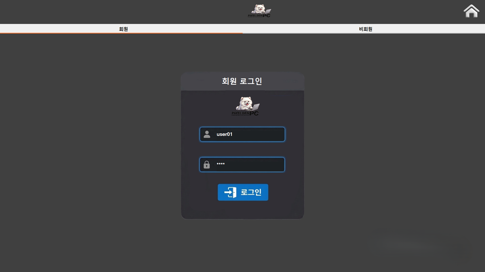
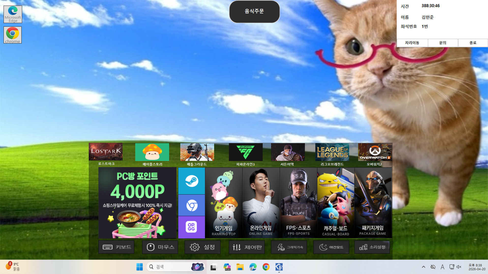

# 🎮 PC방 키오스크 시스템


TCP/IP 기반 키오스크, 사용자, 관리자 간 통신 시스템과 QR 인증 기능을 포함한 PC방 통합 관리 시스템입니다.

---

## 📌 프로젝트 소개
본 프로젝트는 PC방 환경을 가정하여,  
키오스크를 통한 좌석 선택 및 결제, 사용자 PC 이용 관리, 관리자 서버 제어, QR 인증 기능까지 포함한 통합 시스템을 구현했습니다.

각 구성 요소 간 TCP/IP 통신을 통해 실시간 데이터 처리를 수행하며,  
클라이언트-서버 구조 기반으로 사용자, 관리자, 키오스크 간 데이터 흐름을 설계했습니다.

또한 SQLite 기반 사용자 및 좌석 데이터 관리 기능과 관리자-사용자 간 실시간 채팅 기능을 통해 실제 PC방 운영 흐름을 반영하도록 구성했습니다.

---

## 📅 프로젝트 정보
- 개발 기간: 2026.03.05 ~ 2026.03.17
- 개발 형태: 팀 프로젝트
- 개발 언어: C#
- 개발 환경: Visual Studio

---

## 🧩 시스템 구성
- Kiosk (키오스크)
- User Client (사용자 PC)
- Admin Server (관리자)
- QR Module (QR 인증)
- TCP/IP 기반 클라이언트-서버 통신 구조

---

## 🔄 시스템 흐름
1. 사용자가 키오스크에서 로그인 및 좌석 선택  
2. 결제 및 이용 시간 등록  
3. 사용자 PC에서 로그인 후 이용 시작  
4. 관리자 서버에서 전체 좌석 및 상태 관리  
5. 관리자와 사용자 간 실시간 채팅 처리  
6. QR 인증을 통한 사용자 인증 처리  

---

## 🛠 기술 스택

| 구분 | 내용 |
|------|------|
| Language | C# |
| Framework | WinForms (.NET Framework) |
| Communication | TCP/IP Socket |
| Database | SQLite |
| Authentication | QR Authentication |
| Library | ZXing, AForge.NET |
| IDE | Visual Studio |

---

## 💡 주요 기능

### 🎮 키오스크 기능
- 로그인 및 회원 관리 기능
- 좌석 선택 및 이용 시간 등록 기능
- 결제 및 시간 충전 기능
- 좌석 상태 기반 이용 처리 기능

### 💻 사용자 PC 기능
- 사용자 로그인 및 이용 상태 관리
- 관리자와의 실시간 채팅 기능
- 음식 주문 및 이용 제어 기능
- 사용자 이용 시간 확인 기능

### 🖥 관리자 서버 기능
- 전체 좌석 상태 및 사용자 관리
- TCP 서버 기반 실시간 통신 처리
- 사용자 접속 상태 및 이용 정보 확인
- 음식 주문 및 사용자 요청 처리 기능

#### 🔐 권한 분리 기능
- **사장(관리자)** : 매출 확인, 회원 관리, 전체 데이터 조회
- **아르바이트(스태프)** : 좌석 상태 확인, 주문 처리

### 📷 QR 인증 기능
- 카메라 기반 QR 코드 인식 기능
- QR 코드 기반 사용자 인증 처리
- 웹캠 영상 기반 실시간 QR 스캔 처리

---

## 👨‍💻 구현 내용
- C# WinForms 기반 키오스크 및 사용자 프로그램 구현
- TCP/IP Socket 기반 클라이언트-서버 통신 구현
- SQLite 기반 사용자 및 좌석 데이터 관리 구현
- 관리자-사용자 간 실시간 채팅 기능 구현
- QR 코드 기반 사용자 인증 기능 구현
- ZXing 기반 QR 디코딩 기능 구현
- AForge.NET 기반 웹캠 영상 처리 기능 구현
- 좌석 상태 및 이용 시간 관리 기능 구현

---

## ⚙️ 문제 해결 경험

### 🔌 TCP 통신 연결 문제
- 클라이언트와 서버 간 데이터 송수신 과정에서 연결이 불안정하게 유지되는 문제가 발생
- 연결 상태 확인 및 예외 처리 로직을 추가하여 통신 안정성 개선

### 💺 좌석 상태 동기화 문제
- 사용자 및 관리자 화면 간 좌석 상태가 즉시 반영되지 않는 문제가 발생
- 서버 기반 상태 갱신 구조를 통해 실시간 좌석 상태 동기화 처리

### 📷 QR 인증 처리 문제
- QR 인식 결과와 사용자 데이터 비교 과정에서 인증 실패 문제가 발생
- QR 데이터 처리 및 사용자 조회 로직을 수정하여 인증 정확도 개선

---

## 🧠 설계 포인트
- TCP/IP 기반 클라이언트-서버 구조 설계
- 사용자, 관리자, 키오스크 역할 기반 시스템 분리 구성
- 실시간 좌석 상태 및 사용자 데이터 처리 구조 설계
- QR 기반 사용자 인증 흐름 구성
- SQLite 기반 로컬 데이터 관리 구조 설계

---

## 🚀 프로젝트 특징
- TCP/IP 기반 실시간 통신 시스템 구현
- 키오스크, 사용자, 관리자 역할 기반 시스템 분리 구성
- QR 인증 기반 사용자 로그인 처리 기능 구현
- SQLite 기반 사용자 및 좌석 데이터 관리 기능 구현
- 관리자-사용자 간 실시간 채팅 기능 구현

---

## 📁 프로젝트 구조

```text
pcbang-kiosk-system/

├── kiosk/            # 키오스크 프로그램
│
├── user/             # 사용자 PC 프로그램
│   ├── Login         # 로그인 처리
│   ├── Seat          # 좌석 이용 및 상태 관리
│   ├── Chat          # 관리자 문의 채팅
│
├── admin/            # 관리자 서버 프로그램
│   ├── Server        # TCP 서버 실행
│   ├── SeatManager   # 좌석 상태 관리
│   ├── UserManager   # 사용자 관리
│
├── qr/               # QR 인증 모듈
│   └── QR 인증 및 카메라 처리
│
├── docs/             # 발표 자료
│   └── pcbang_kiosk_presentation.pdf
│
├── images/           # README 실행 화면 이미지
│
├── .gitignore
└── README.md
```

---

## 🙋 담당 역할
- TCP/IP 기반 클라이언트-서버 통신 기능 구현
- 관리자-사용자 간 실시간 채팅 기능 구현
- SQLite 기반 사용자 및 좌석 데이터 처리 구현
- QR 기반 사용자 인증 기능 구현
- WinForms 기반 사용자 UI 구성 및 기능 구현

---

## 🎥 시연 영상
시연 영상은 추후 업로드 예정입니다.

---

## 📑 발표 자료
- [발표자료 보기](docs/pcbang_kiosk_presentation.pdf)

---

## 🖥 시스템 구조 (순서도)
사용자, 관리자, 키오스크 간 전체 흐름을 나타낸 순서도입니다.


---

## 📷 실행 화면

### 🔐 QR 인증 기능
카메라를 통해 QR 코드를 스캔하고 사용자 인증을 수행하는 기능입니다.

- **ZXing** : QR 코드 인식 및 디코딩 처리
- **AForge.NET** : 웹캠 영상 캡처 및 프레임 처리


---

### 🎮 키오스크 화면

#### 🔐 로그인 화면


#### 💺 좌석 선택 화면


#### 💳 결제 화면


---

### 💻 사용자 PC 화면

#### 🖥 메인 화면


#### 💬 채팅 기능


#### 🍜 음식 주문 기능


---

### 🖥 관리자 화면

#### 👨‍💼 사장(관리자) 화면


#### 🧑‍🍳 아르바이트(스태프) 화면

