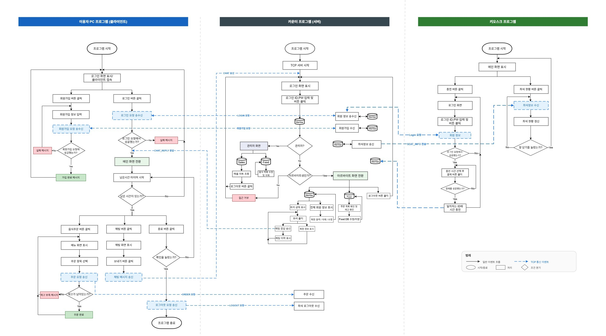
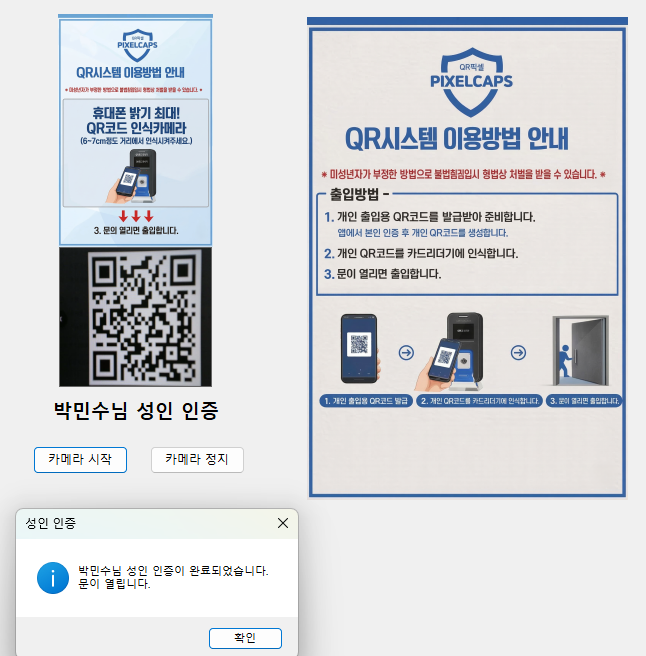

# 🎮 PC방 키오스크 시스템

TCP 기반 키오스크, 사용자, 관리자 간 통신 시스템 및 QR 인증 기능을 포함한 PC방 관리 프로그램입니다.

---

## 📌 프로젝트 소개
본 프로젝트는 PC방 환경을 가정하여,  
키오스크를 통한 좌석 선택 및 결제, 사용자 PC 이용 관리, 관리자 서버 제어, QR 인증 기능까지 포함한 통합 시스템을 구현했습니다.  

각 구성 요소 간 TCP 통신을 통해 실시간 데이터 처리를 수행하며,  
클라이언트-서버 구조 기반으로 데이터 흐름을 설계했습니다.

---

## 📅 프로젝트 정보
- 개발 기간: 2026.03.05 ~ 2026.03.17  
- 개발 형태: 팀 프로젝트  

---

## 🧩 시스템 구성
- Kiosk (키오스크)  
- User Client (사용자 PC)  
- Admin Server (관리자)  
- QR Module (QR 인증)  
- TCP 통신 기반 구조  

---

## 🔄 시스템 흐름
1. 사용자가 키오스크에서 로그인 및 좌석 선택  
2. 결제 및 이용 시간 등록  
3. 사용자 PC에서 로그인 후 이용 시작  
4. 관리자 서버에서 전체 좌석 및 상태 관리  
5. QR 인증을 통한 사용자 인증 처리  

---

## 🛠 기술 스택
| 구분 | 내용 |
|------|------|
| Language | C# |
| Framework | WinForms |
| Communication | TCP/IP Socket |
| Database | SQLite |
| Library | ZXing, AForge |

---

## 💡 주요 기능

### 🎮 키오스크
- 로그인 및 회원 관리  
- 좌석 선택  
- 결제 및 시간 충전  

### 💻 사용자 PC
- 로그인 및 이용 상태 관리  
- 관리자와 채팅 기능  
- 메뉴 및 사용 제어  

### 🖥 관리자 서버
- 전체 좌석 상태 관리  
- 사용자 접속 및 이용 상태 확인  
- TCP 서버 기반 통신 처리  

### 📷 QR 인증
- 카메라 기반 QR 코드 인식  
- 사용자 인증 처리  

---

## 🎥 시연 영상
[시연 영상 보기](여기에_영상링크_넣기)

---

## 📁 프로젝트 구조

```text
pcbang-kiosk-system/
│
├── kiosk/            # 키오스크 프로그램 (로그인, 좌석 선택, 결제)
│
├── user/             # 사용자 PC 프로그램
│   ├── Login         # 로그인 처리
│   ├── Seat          # 좌석 이용 및 상태 관리
│   ├── Chat          # 관리자 문의 채팅 (TCP 통신)
│
├── admin/            # 관리자 서버 프로그램
│   ├── Server        # TCP 서버 실행
│   ├── SeatManager   # 좌석 상태 관리
│   ├── UserManager   # 사용자 관리
│
├── qr/               # QR 인증 기능
│   └── QR 인식 및 인증 처리 (ZXing + AForge.NET)
│
└── images/           # README 이미지 파일

```

---

## 📷 실행 화면

### 🖥 시스템 순서도
사용자, 관리자, 키오스크 간 전체 흐름을 나타낸 순서도입니다.  


---

### 📷 QR 인증 화면
카메라를 통해 QR 코드를 스캔하고 사용자 인증을 수행하는 기능입니다.
- ZXing : QR 코드 인식 및 디코딩 처리
- AForge.NET : 웹캠(카메라) 영상 캡처 및 프레임 처리




